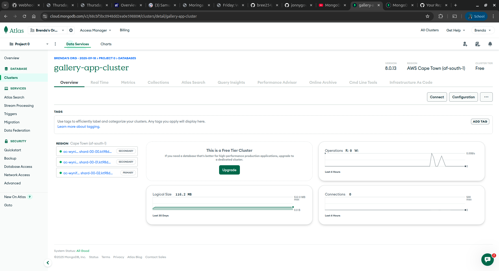
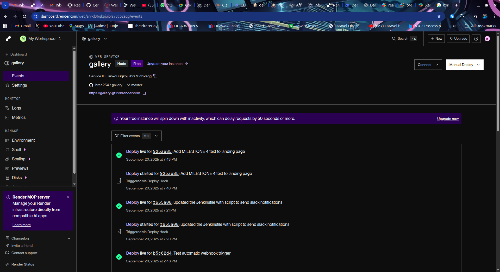
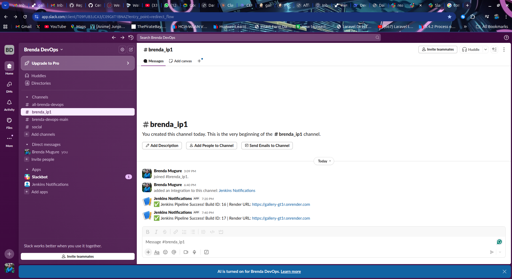

# Gallery CI/CD Pipeline Project

A Node.js image gallery application with complete CI/CD pipeline implementation using Jenkins, MongoDB Atlas, Render, and Slack integration.

**Live Application:** [https://gallery-gt1r.onrender.com](https://gallery-gt1r.onrender.com)

## 📋 Milestones Completed

### ✅ Milestone 1: Setup & Configuration
- [x] Forked and cloned repository
- [x] Set up MongoDB Atlas cluster
- [x] Configured environment variables for database connection
- [x] Updated `_config.js` with MongoDB credentials



### ✅ Milestone 2: Basic CI/CD Pipeline
- [x] Created Jenkinsfile with required stages:
  - Checkout code from GitHub
  - Install dependencies (`npm install`)
  - Deploy to Render
- [x] Added "MILESTONE 2" text to landing page
- [x] Configured automatic triggering via GitHub webhooks
- [x] Successful deployment to Render



### ✅ Milestone 3: Testing & Email Notifications
- [x] Merged test branch with main branch
- [x] Updated Jenkinsfile to execute tests (`npm test`)
- [x] Configured email notifications on test failure
- [x] Added "MILESTONE 3" text to landing page
- [x] All tests passing with MongoDB connection

**Test Results:**
```
✓ should list ALL photos on / GET (6417ms)
1 passing (6s)
Connected to Database: mongodb+srv://****:****@****/darkroom-test
```

### ✅ Milestone 4: Slack Integration
- [x] Created Slack channel `Brenda_IP1`
- [x] Set up Slack app with incoming webhooks
- [x] Updated Jenkinsfile with Slack notifications on success
- [x] Added "MILESTONE 4" text to landing page
- [x] Invited TM to Slack channel
- [x] Messages include build ID and Render URL



## 🔧 Jenkins Pipeline

### Latest Build (#17) - SUCCESS ✅
**Triggered by:** GitHub push by bree254
**Stages:**
1. **Checkout** - Pull code from GitHub
2. **Install Dependencies** - `npm install` (255 packages in 8s)
3. **Test** - MongoDB connection test (1 passing in 6s)
4. **Deploy** - Render deployment via webhook
5. **Notify** - Slack success message

**Slack Notification:**
```
✅ Jenkins Pipeline Success! Build ID: 17 | Render URL: https://gallery-gt1r.onrender.com
```

## 🔄 Pipeline Flow

```
GitHub Push → Webhook → Jenkins → Tests → Deploy → Slack Notification
```

## 🚀 Live Website

Visit [https://gallery-gt1r.onrender.com](https://gallery-gt1r.onrender.com) to see:
- ✅ MILESTONE 2 (Teal)
- ✅ MILESTONE 3 (Orange)
- ✅ MILESTONE 4 (Purple)
- ✅ Functional image gallery

## 📱 Notifications

- **Email:** Sent on test failures to brendawanjiru72@gmail.com
- **Slack:** Sent on success to #brenda_ip1 channel with build info

## ✅ Requirements Met

- [x] Complete CI/CD pipeline with Jenkins
- [x] Automatic testing and deployment
- [x] MongoDB Atlas integration
- [x] Email notifications on failure
- [x] Slack integration for success
- [x] GitHub webhook automation
- [x] All milestones visible on live site

---

**Author:** Brenda Mugure
**GitHub:** https://github.com/bree254/gallery
**Live Site:** https://gallery-gt1r.onrender.com